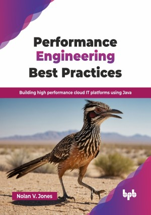

# Performance Engineering Best Practices

Building high performance cloud IT platforms using Java .

This is the repository for [Performance Engineering Best Practices
](https://bpbonline.com/products/performance-engineering-best-practices?variant=44386570502344),published by BPB Publications.

## About the Book
Elevate your application's performance with "Performance Engineering Best Practices." This comprehensive guide provides the knowledge and techniques to optimize your software's speed, scalability, and reliability. Learn the skills of performance engineering, refine your craft, identify and eliminate performance bottlenecks, and ensure your applications deliver exceptional user experiences. 

This book explores Performance Engineering, covering foundational concepts, advanced techniques, and emerging trends. It defines performance engineering versus performance testing, highlights its role in organizational success, and stresses integrating performance throughout development. Key topics include service level objectives (SLOs), cloud performance challenges, and balancing capacity with costs. The book details optimization techniques for cloud platforms, Java, databases, and architectural styles while addressing observability with logging, error handling, and alert strategies. It concludes with insights into AI/ML integration and the impact of evolving technologies.

After reading the book, the reader will gain a holistic understanding of performance and what to do with the design process, implementation, and testing stages of the development lifecycle to ensure fast IT platforms. 

## What You Will Learn
• Understand the basics of performance engineering and how it differs from Performance Testing.

• Learn to apply performance principles throughout the software development lifecycle (SDLC).

• Explore cloud-specific challenges, like scaling, regional latency, and managing costs.

• Master techniques for optimizing JVM, writing efficient Java code, and database performance.

• Discover tools for performance automation, observability, alerting, and creating scalable architectures.
